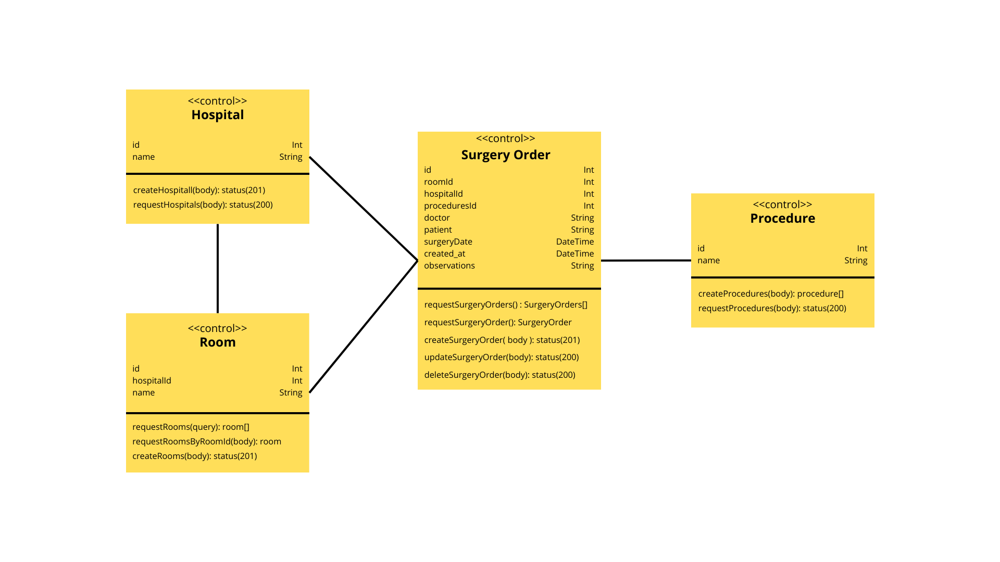

 
# Code Challenge: Pedido cirúrgico
### Autor do projeto: Aislan Dias

## Como iniciar este projeto

```bash
git clone https://github.com/AislanDias/Surgery-Orders.git

# Entrar na pasta do repositorio
cd Surgery-Orders/

# Entrar na pasta backEnd
cd backEnd

# Postgres Database ( A porta que está sendo utilizada é a 5432)
docker compose up -d

# Instalar dependencias
npm i

# Migrations ( Criar as tabelas no banco de dados)
npx prisma migrate dev

# Povoar as tabelas Procedimentos, Salas e Hospitais
npm run test:env

# Iniciar o servidor back-End ( A porta que está sendo utilizada é a 3443)
npm run start:dev

cd ..

# Entrar na pasta frontEnd
cd frontEnd

# Instalar dependencias
npm i

# Executar projeto react ( A porta que está sendo utilizada é a 3000)
npm run dev

# Agora é só abrir o navegador e ir para o endereço: localhost:3000
# Happy journey!
```

## Como rodar os testes deste projeto

```bash
# Entrar na pasta backEnd
cd BackEnd

# Testes Unitários
npm run test

# Testes de Integração
npm run test:itg

# Testes de Ponta a Ponta
npm run test:e2e
```

## Requisitos

### Requisitos funcionais

- [x] Deve ser possível cadastrar pedidos cirúrgicos;
- [x] Deve ser possível excluir pedidos cirúrgicos;
- [x] Deve ser possível atualizar pedidos cirúrgicos;
- [x] Deve ser possível visualizar pedidos cirúrgicos;
- [x] Deve ser possível listar pedidos cirúrgicos;

### Regras de negócio

- [x] O usuário não deve poder agendar um mesmo pedido cirúrgico no mesmo dia e local de outra pessoa;
- [x] O usuário não pode agendar um pedido cirúrgico para o passado;

### Requisitos não-funcionais

- [x] NestJS como framework backend
- [x] Banco de dados (MySQL ou Postgres) para armazenar os dados dos pedidos cirúrgicos.
- [x] Prisma ou TypeORM como ORM para manipular o banco de dados.
- [x] Testes unitários e de integração para garantir a qualidade do código no backEnd.
- [x] Foco na arquitetura limpa
- [x] Realizar documentação do código
- [x] Context API para o gerenciamento de estado, incluindo o controle de status.
- [x] Styled Components para a estilização do CSS
- [x] Aplicação responsiva para ambientes desktop e mobile
- [x] Testes unitários para as partes críticas do frontend

## Casos de Uso (Modelo Conceitual)


## Banco de Dados (Modelo Conceitual)


## Estrutura Conceitual das Controllers no BackEnd



